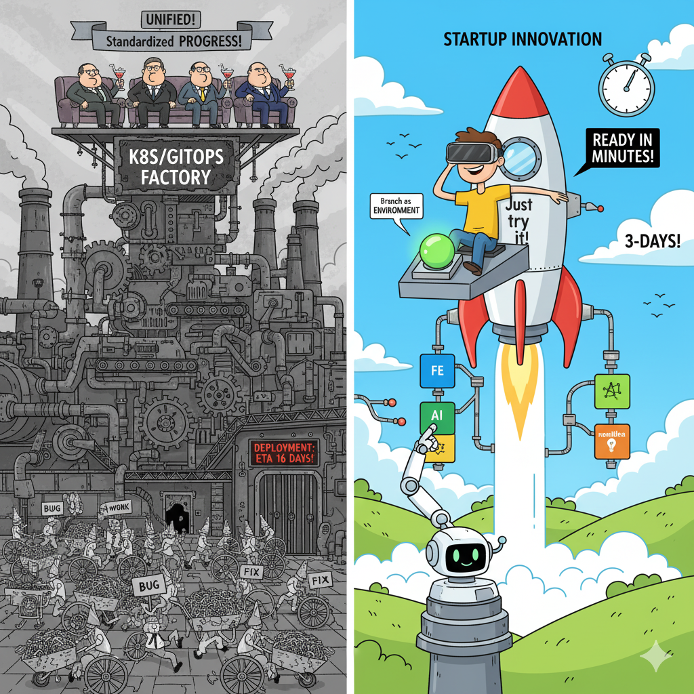

# Self-Propelling, Dynamic Environment Architecture for AWS

## **The Methodology Foundation: OnDemandEnv.dev**

> **📖 This is the simplified open-source version of [OnDemandEnv.dev](https://ondemandenv.dev)**  
> **🔬 For complete methodology and analysis, see [OnDemandEnv Articles](https://ondemandenv.dev/articles.html)**  
> **🏗️ This repository demonstrates infrastructure for a single service as part of a microservice architecture**

This project implements the core principles from OnDemandEnv.dev's research into dynamic environment architectures. The methodology foundation comes from extensive analysis of why traditional Infrastructure as Code approaches fail and how to build systems that enable true developer autonomy.

**For enterprise microservice patterns**: Runtime code runs in private subnets, with service-to-service communication through VPC PrivateLink and VPC endpoints to keep all traffic within the AWS backbone. See [Inter-Service Communication Guide](./inter-service-com.md) for complete patterns.

### **Key Methodology Articles**

**🔬 [The Great Deception: Reclaiming Infrastructure as Code](https://ondemandenv.dev/articles/the-great-deception-reclaiming-infrastructure-as-code)**  
The fundamental analysis of why Infrastructure as Code has failed its promise and the path to true infrastructure abstraction.

**🚶 [Walking on Many Feet: Contract Branches](https://ondemandenv.dev/articles/walking-on-many-feet-contract-branches/)**  
The architectural pattern that enables parallel experimentation through independent environments.

**🧠 [Semantic Engineering Revolution](https://ondemandenv.dev/articles/semantic-engineering-revolution)**  
How to move from mechanical configuration management to semantic intent-driven infrastructure.

**🤖 [AI Agent Workflow Platform Architecture](https://ondemandenv.dev/articles/ai-agent-workflow-platform-architecture)**  
Designing infrastructure systems where AI agents are first-class participants with full bounded context autonomy.

**📊 [The Abstraction Ladder](https://ondemandenv.dev/articles/abstraction-ladder)**  
Framework for understanding levels of infrastructure abstraction and why declarative DSLs get trapped at lower rungs.

**⚡ [EKS Critique Series](https://ondemandenv.dev/articles/eks-critique-series/)**  
Comprehensive analysis of why Kubernetes approaches create complexity for simple tasks.

## "You Can't Win a Race by Committee" - The Startup Disruption Engine

**This architecture is for startups who dare to try a different path.** While enterprises are trapped in Kubernetes committee-driven development, this enables **true DDD microservices + AI agents** where every decision can be made at the speed of thought, not the speed of platform team meetings.

**The competitive insight**: Companies invested in Kubernetes carry massive technical debt that prevents AI-speed evolution. This creates perfect opportunities for startups to outmaneuver established monopolies through **committee-free development**.

### **The Great Betrayal: How Kubernetes GitOps Violated True Microservices**

> **📖 Detailed analysis: [The Great Inversion: Reverse Competence](https://ondemandenv.dev/articles/the-great-inversion-reverse-competence)**

Kubernetes GitOps has betrayed the essence of microservices: **loose coupling and independent SDLC**. Eric Evans' Domain-Driven Design envisioned services owning their complete bounded context—business logic, data, AND infrastructure. Instead, we got shared infrastructure contexts that create tight operational coupling.

| DDD Principle | Original Intent | Kubernetes Reality | This Architecture |
|---------------|-----------------|-------------------|-------------------|
| **Bounded Context** | Service owns complete domain | Business logic only | Complete stack ownership |
| **Loose Coupling** | API-only communication | Shared cluster dependencies | True isolation: separate VPCs/DBs |
| **Independent Deployment** | Deploy when ready | Coordinated deployment windows | `git push` anytime |
| **Technology Diversity** | Right tool per domain | Platform-mandated stack | Free technology choice |
| **Autonomous Teams** | All decisions | Business logic only | Complete SDLC control |

### **The Infrastructure Factory: Reclaiming True DDD**

This architecture implements Eric Evans' original vision enhanced for the AI era:

- **True Bounded Contexts**: Teams own business logic + infrastructure + deployment
- **AI Agent Compatibility**: AI agents get the same bounded context isolation
- **Parallel Evolution**: Human developers and AI agents experiment independently
- **Conway's Law Alignment**: Organizational independence → Technical independence

**The test**: Can you delete a service completely without coordination? 
- **Kubernetes**: ❌ Requires platform team coordination
- **This Architecture**: ✅ `cdk destroy` - zero impact on other services

### **Infrastructure Comparison: Factory vs. Static Configuration**

> **📖 Why static models fail: [The Great Deception](https://ondemandenv.dev/articles/the-great-deception-reclaiming-infrastructure-as-code)**

| Component | This Architecture (Per Branch) | Typical Kubernetes GitOps |
|-----------|--------------------------------|---------------------------|
| **Networking** | Complete VPC with public/private subnets, NAT gateways, security groups | Shared cluster networking, namespace isolation only |
| **Database** | Dedicated DocumentDB cluster with backup, monitoring, custom metrics | Shared database OR complex operator-managed instances |
| **Load Balancing** | Application Load Balancer with health checks, SSL termination | Ingress controller on shared infrastructure |
| **DNS & SSL** | Route53 + CloudFront + ACM certificates per environment | Shared wildcard certificates, complex subdomain routing |
| **Monitoring** | CloudWatch dashboards, log groups, custom metrics per environment | Shared Prometheus/Grafana, namespace-level isolation |
| **Storage** | Dedicated S3 buckets with proper CORS and policies | PersistentVolumeClaims on shared storage classes |
| **Container Registry** | Dedicated ECR repository per environment | Shared registry with tag management complexity |
| **Secrets Management** | AWS Secrets Manager + Parameter Store per environment | Kubernetes secrets + external secret operators |

### **Infrastructure Complexity: Static Configuration vs. Dynamic Factory**

> **📖 Theory: [The Abstraction Ladder](./The%20Great%20Deception_%20Reclaiming%20Infrastructure%20_as%20Code_.md#the-abstraction-mechanism-ascending-the-ladder-in-iac)**

This architecture demonstrates the **Infrastructure Factory** model where complete environments are generated programmatically, proving that even complex infrastructure becomes trivial to provision per branch.



**The Fundamental Choice**: Shared infrastructure creates operational complexity and tight coupling. This architecture chooses isolated simplicity over shared complexity, enabling true microservice independence.

> **📖 Why this matters for AI agents**: [AI Agent Workflow Platform Architecture](https://ondemandenv.dev/articles/ai-agent-workflow-platform-architecture)**

## "You Can't Win a Race by Committee" - The Speed Advantage

### **The Admin vs. Software Engineering Mindset**

> **📖 Deep dive: [Root Cause Analysis Series](https://ondemandenv.dev/articles/root-cause-x-ops-flat-worldview-1)**

The root of infrastructure inefficiency lies in a cultural schism:

**Admin Mindset (State-Oriented)**:
- Concerned with achieving specific target states  
- Artifacts are configuration files (terraform.tfvars, values.yaml)
- Goal: Correctness and stability of particular instances
- **Result**: Committee-driven development with manual promotion rituals

**Software Engineering Mindset (Abstraction-Oriented)**:
- Concerned with building reusable, composable systems
- Artifacts are dynamic components (functions, classes, modules)  
- Goal: Systems that generate any valid state based on inputs
- **Result**: Individual developers with programmatic infrastructure control

> **Enterprise Kubernetes organizations have turned software development into a committee sport. Startups using this architecture compete as individual racers.**

### **The DORA Metrics Revolution: From Static to Dynamic**

> **📖 Complete analysis: [Semantic Engineering Revolution](https://ondemandenv.dev/articles/semantic-engineering-revolution)**

The Infrastructure Factory model directly improves all four DORA metrics that define elite DevOps performance:

| DORA Metric | Static Configuration Problem | Infrastructure Factory Solution | Impact |
|-------------|-----------------------------|---------------------------------|---------|
| **Lead Time for Changes** | Staging bottlenecks, manual promotion | On-demand ephemeral environments | **Decreases** |
| **Deployment Frequency** | Fear of breaking shared staging | Isolated testing increases confidence | **Increases** |  
| **Change Failure Rate** | Environment drift, untested changes | Guaranteed environment consistency | **Decreases** |
| **Time to Restore Service** | Complex manual rollbacks | `cdk destroy` + redeploy previous commit | **Decreases** |

**The strategic insight**: The choice of IaC paradigm is a leading indicator of DORA performance potential. Static configuration models actively harm these metrics, while Infrastructure Factory models provide the foundational capabilities for elite performance.

### **The Committee-Driven Development Trap**

> **📖 The productivity costs: [Root Cause Analysis - Flat Worldview](https://ondemandenv.dev/articles/root-cause-x-ops-flat-worldview-2)**
```
┌─────────────────────────────────────────────────────────────┐
│                    THE COMMITTEE                            │
│  ┌─────────────┐ ┌─────────────┐ ┌─────────────┐ ┌─────────┐ │
│  │Platform Team│ │Security Team│ │  DBA Team   │ │Ops Team │ │
│  │   Meeting   │ │   Review    │ │  Approval   │ │ Deploy  │ │
│  └─────────────┘ └─────────────┘ └─────────────┘ └─────────┘ │
│           │             │             │             │        │
│           ▼             ▼             ▼             ▼        │
│      2-3 days      1-2 days      1-3 days      1-2 days     │
│                                                              │
│         Total: 5-10 days for simple infrastructure change   │
└─────────────────────────────────────────────────────────────┘
```

**Startup with This Architecture**:
```
┌─────────────────────────────────────────────────────────────┐
│                   THE INDIVIDUAL RACER                      │
│  ┌─────────────────────────────────────────────────────────┐ │
│  │           Developer/AI Agent Decision                   │ │
│  │              ↓ git push ↓                              │ │
│  │           8 minutes later: Complete environment        │ │
│  └─────────────────────────────────────────────────────────┘ │
└─────────────────────────────────────────────────────────────┘
```

### Why the Committees Are No Longer Needed: Cloud-Native Controls

The committee-driven model arose from a necessity to manage risk and complexity in on-premise data centers. However, modern cloud platforms like AWS have rendered this model obsolete by providing sophisticated, programmable controls that can be managed through code.

-   **The Security Team** is replaced by **AWS IAM & VPC**. Instead of manual security reviews, you define granular permissions with IAM roles and network isolation with VPC security groups. These are version-controlled, auditable, and automatically enforced.
-   **The DBA Team** is replaced by **Amazon RDS & DocumentDB**. Instead of waiting for a DBA to provision and tune a database, you define a fully managed database instance in your CDK code. Backups, patching, and scaling are handled by AWS, with performance metrics available via CloudWatch.
-   **The Ops Team** is replaced by **AWS CDK & ECS/Fargate**. Instead of an ops team performing manual deployments, your infrastructure and application are deployed automatically via a CI/CD pipeline triggered by a `git push`. Serverless compute like Fargate removes the need to manage underlying servers.
-   **The Platform Team** is replaced by **Developer-Owned Infrastructure**. The "platform" is no longer a centralized gatekeeper but a set of well-architected, reusable CDK constructs that development teams can use to build the exact infrastructure they need, when they need it.

By leveraging managed services, we shift from a model of **human gatekeeping** to one of **programmatic enforcement**. The expertise that was once siloed within committees is now codified into the infrastructure itself, giving developers total control and responsibility within a safe, automated framework.


### The Decision Velocity Gap

| Decision Type | Enterprise Committee Process | Startup Individual Action |
|---------------|----------------------------|---------------------------|
| **Database Technology Choice** | Platform committee → Architecture review → Security approval → 2-6 weeks | Developer decision → `git push` → 8 minutes |
| **New Environment for Testing** | Infrastructure ticket → Platform team queue → Resource allocation → 3-5 days | Branch creation → Automatic deployment → 8 minutes |
| **Performance Optimization** | Performance team → Platform team → Database team → Coordination → 2-4 weeks | AI agent experiment → Isolated testing → 30 minutes |
| **Security Configuration** | Security review → Platform implementation → Testing → Rollback plan → 1-3 weeks | Security-as-code → Automated compliance → 8 minutes |
| **Scaling Strategy** | Capacity planning → Budget approval → Platform team implementation → 2-8 weeks | Auto-scaling configuration → Immediate deployment → 8 minutes |

### The "Dare to Try" Startup Mindset

**This architecture is for founders who believe**:

- **Speed beats consensus** - Individual decisions beat committee decisions
- **Action beats planning** - Try it in production-like environment beat endless meetings
- **Experimentation beats prediction** - Test 10 hypotheses beat debating 1
- **AI partnership beats human bottlenecks** - AI agents as team members beat AI as tools
- **Infrastructure autonomy beats platform dependency** - Own your stack beat rent committee time

### The Competitive Asymmetry: Committee vs. Racer

**Why enterprises can't compete**:

1. **Sunk Cost Paralysis**: $10M+ invested in platform teams and Kubernetes expertise
2. **Political Momentum**: Platform teams have organizational power and resist displacement  
3. **Risk Aversion**: "Nobody gets fired for choosing Kubernetes" (even when it's wrong)
4. **Committee Inertia**: Changing architecture requires consensus across 5+ teams
5. **Career Incentives**: Platform engineers' job security depends on maintaining complexity

**Why startups can leap ahead**:

1. **Zero Sunk Costs**: Start with the best architecture, not legacy constraints
2. **Individual Decision Making**: Founder/CTO decides, team executes
3. **Risk Embracing**: "Nobody gets funded for playing it safe"
4. **Speed Incentives**: Success depends on outpacing competitors, not managing committees
5. **AI-Native Thinking**: AI agents as partners from day one, not afterthoughts

### The Race Analogy: Marathon vs. Sprint

**Enterprise Kubernetes**: Marathon with handoffs
- Multiple runners (teams) must coordinate
- Each handoff risks dropping the baton
- Speed limited by slowest runner
- Success requires perfect team coordination

**Startup with This Architecture**: Individual sprint
- Single runner (developer + AI agents) controls entire race
- No handoffs, no coordination overhead
- Speed limited only by individual capability + AI augmentation
- Success requires individual excellence + smart tooling

### The Founder's Choice: Committee or Racer?

**Committee Path** (Enterprise Thinking):
- "We need a platform team to manage complexity"
- "Security requires centralized review processes"  
- "Database decisions need DBA oversight"
- "We should follow industry best practices"
- **Result**: 10x slower than competitors, but "industry standard"

**Racer Path** (This Architecture):
- "Developers own their complete stack"
- "Security is code that deploys automatically"
- "AI agents optimize infrastructure continuously"  
- "We build competitive advantages, not copy best practices"
- **Result**: 10x faster than competitors, potentially industry-changing

**The dare**: Will you build a committee or train racers?

### Full SDLC Independence Comparison

**The real revolution isn't just technical—it's organizational.** This architecture enables complete Software Development Lifecycle autonomy per service team:

| SDLC Phase | This Architecture (True Autonomy) | Typical Kubernetes GitOps (Shared Control) |
|------------|-----------------------------------|-------------------------------------------|
| **Infrastructure Definition** | Service team owns CDK/Terraform code, defines their own databases, queues, networking | Platform team owns infrastructure, service teams file tickets for changes |
| **Environment Provisioning** | `git push` → full environment in 8 minutes, zero approvals needed | Submit tickets, wait for platform team, coordinate with ops, 2-5 day SLA |
| **Database Schema Changes** | Direct database access, team controls migrations and rollbacks | Submit database change requests, DBA review, scheduled maintenance windows |
| **Deployment Pipeline** | Team owns GitHub Actions, can modify CI/CD without permission | Shared Jenkins/GitOps pipeline controlled by platform team, change requests required |
| **Monitoring & Alerting** | Team defines CloudWatch dashboards, custom metrics, log retention | Shared Grafana/Prometheus, platform team controls dashboards and alert routing |
| **Secret Management** | Direct AWS Secrets Manager/Parameter Store access per environment | Kubernetes secrets managed by platform team, limited self-service |
| **Load Testing** | Spin up dedicated environment with production-like load balancers | Shared staging environment, coordinate test windows, resource conflicts |
| **Troubleshooting** | SSH/SSM into dedicated EC2 instances, full CloudWatch access | Kubernetes exec into shared pods, limited observability, noisy neighbor issues |
| **Technology Choices** | Team chooses database engines, messaging systems, cache layers freely | Platform team mandates technology stack, limited approved services |
| **Rollback Strategy** | `cdk destroy` + redeploy clean environment in minutes | Complex namespace cleanup, database rollbacks, coordination with other teams |

**The Key Insight**: In Kubernetes GitOps, service teams own their *code* but surrender control of their *infrastructure, deployment, and operations*. This creates a **distributed monolith** where services are independent in the codebase but operationally dependent on centralized platform teams.

**True microservice independence** means owning the entire software development lifecycle, not just the source code.

### The Organizational Revolution: From "Ticket-Driven Development" to True Autonomy

**The hidden cost of Kubernetes GitOps isn't technical—it's organizational.** Most "microservice" architectures create a feudal system:

```
┌──────────────────────────────────────────────────────────--───┐
│                    THE PLATFORM KINGDOM                       │
│  ┌─────────────────┐  ┌─────────────────┐  ┌─────────────────┐ │
│  │   Ops Lords     │  │   DBA Nobles    │  │ Security Guards │ │
│  │ (Infrastructure)│  │  (Database)     │  │   (Secrets)     │ │
│  └─────────────────┘  └─────────────────┘  └─────────────────┘ │
│           │                     │                     │        │
│           ▼                     ▼                     ▼        │
│  ┌─────────────────────────────────────────────────────────────┐ │
│  │                   Service Serfs                             │ │
│  │   (Own code in container, beg for everything else)          │ │
│  └─────────────────────────────────────────────────────────────┘ │
└─────────────────────────────────────────────────────────────┘
```

**Service teams end up spending more time managing tickets than writing code.**

#### Daily Reality Check: Feature Development Timeline

**Typical Kubernetes GitOps Workflow**:
```
Day 1:   Developer starts feature, needs test database
Day 2:   Submit infrastructure ticket to platform team  
Day 3-5: Ticket review, security approval, resource allocation
Day 6:   Database provisioned in shared staging environment
Day 7:   Discover database conflicts with another team's test data
Day 8:   Submit ticket for dedicated database schema
Day 10:  Schema approved, need to coordinate deployment window
Day 12:  Feature deployed to staging, shared load balancer timeout issues
Day 14:  Submit ticket for load balancer tuning
Day 16:  Load balancer fixed, ready for prod (if environment still consistent)
```
**Total: 16 days with 5 different tickets and 3 team dependencies**

**This Architecture Workflow**:
```
Day 1:  Developer starts feature, git push creates complete environment
Day 2:  Feature complete, tested in production-like environment  
Day 3:  Deploy to main branch, cleanup dynamic environment
```
**Total: 3 days, zero tickets, zero dependencies**

### The "Platform Team as Internal Startup" Model

This architecture flips the relationship. Instead of **platform team as gatekeeper**, it becomes **platform team as internal product company**:

- **Service teams are customers**, not subjects
- **Platform team competes on value**, not mandate  
- **If platform tools are slow/clunky**, service teams can build their own
- **Platform team success** measured by adoption rate, not control

**Result**: Platform teams focus on building amazing developer experiences instead of managing access controls.

### Getting Back on Track: True DDD Microservices

**This architecture isn't just an alternative to Kubernetes - it's a return to the original DDD microservice vision.**

#### What We Recover:

1. **True Bounded Contexts**: Each service team owns their complete domain - business logic, data model, storage technology, networking, and deployment strategy. **AI agents get the same bounded context isolation** for clean experimentation.

2. **Genuine Loose Coupling**: Services interact only through APIs. No shared infrastructure dependencies, no coordinated deployments, no platform team bottlenecks. **AI agents operate in isolation** without context pollution from other experiments.

3. **Independent Evolution**: Teams evolve their technology stack (databases, frameworks, deployment tools) based on domain needs, not platform mandates. **AI agents evolve optimization strategies** based on clean metrics from isolated environments.

4. **Autonomous Decision Making**: Domain experts (the service team) make ALL decisions about their bounded context, from business rules to infrastructure choices. **AI agents make optimization decisions** based on complete contextual understanding.

5. **Failure Isolation**: Infrastructure failures in one bounded context cannot affect others - true resilience through isolation. **AI agent experiments** can fail safely without affecting other contexts.

6. **Context Clarity**: Each bounded context has clear domain language and rules. **AI agents get clean signal** without noise from other services or experiments.

#### The DDD Test: Can You Delete a Service Completely?

**True microservice independence test**: Can you completely delete a service and its team without affecting any other service or requiring coordination?

- **Kubernetes GitOps**: ❌ Shared cluster, shared pipeline, shared monitoring - deletion requires platform team coordination
- **This Architecture**: ✅ `cdk destroy` removes entire bounded context, zero impact on other services

### Why This Matters for Domain-Driven Design

**DDD is about more than just code organization** - it's about **organizational design that enables domain expertise to flourish**:

- **Domain Experts as Infrastructure Owners**: The team that understands the payment domain should choose the payment database technology
- **Context-Specific Solutions**: An e-commerce catalog needs different infrastructure than a financial transaction system  
- **Evolution at Domain Speed**: Payment compliance changes shouldn't wait for platform team approval
- **True Domain Ownership**: You can't truly own a domain if you don't control how it's deployed and operated

**The revelation**: Infrastructure-as-Code wasn't meant to be **centralized code** - it was meant to be **domain-specific code owned by domain teams**.

This architecture proves that true DDD microservices are not only possible but **significantly more efficient** than the compromised versions we've accepted in the Kubernetes era.

## Why This Example Chooses the Hard Path (And Why That Matters)

> **This reference implementation deliberately tackles the most expensive, complex infrastructure scenario possible to demonstrate that even the "hard path" easily surpasses Kubernetes GitOps workflows.**

Most "infrastructure-as-code" demos show you how to deploy a simple container or Lambda function. This example intentionally does the opposite. **Every branch deployment provisions:**

- **Complete VPC** with public/private subnets, NAT gateways, and security groups
- **DocumentDB cluster** (MongoDB-compatible) with backup, monitoring, and enhanced logging  
- **ECS Fargate cluster** with auto-scaling and container insights
- **CloudFront distribution** with custom domain and SSL certificates
- **Application Load Balancer** with health checks and target groups
- **Route53 hosted zone management** and DNS routing
- **S3 buckets** for static assets and private storage with proper CORS
- **CloudWatch dashboards** with custom metrics and log aggregation
- **IAM roles and policies** with least-privilege access patterns
- **SSM Parameter Store** configuration management
- **ECR repositories** for container image storage

**The point**: If we can make *this level of complexity* trivial to deploy per branch, then simpler scenarios become laughably easy. Most Kubernetes setups struggle to provision a simple database per namespace, while this system spins up **entire database clusters** per feature branch without breaking a sweat.

### The "Pants Off to Fart" EKS Controllers Alternative

> **Even Kubernetes advocates recognize the problems and suggest using AWS Controllers for Kubernetes (ACK) to manage AWS resources. This is the definition of "taking your pants off to fart" - massive complexity for simple tasks.**

Some might argue: *"But you can use EKS with AWS Controllers for Kubernetes (ACK) to manage AWS resources like RDS from within Kubernetes!"*

This is actually **worse** than traditional Kubernetes GitOps. Here's why:

#### The ACK "Solution" Creates More Problems

**The ACK Workflow for Simple RDS Database**:
```yaml
# 1. Install ACK RDS Controller (more in-cluster complexity)
# 2. Configure IRSA (IAM Roles for Service Accounts)  
# 3. Create RDS YAML:
apiVersion: rds.services.k8s.aws/v1alpha1
kind: DBInstance
metadata:
  name: my-database
spec:
  dbInstanceIdentifier: my-db
  engine: mysql
  dbInstanceClass: db.t3.micro
# 4. Apply YAML and pray the controller works
# 5. Wait for controller to call AWS APIs indirectly
# 6. Hope the controller stays healthy and doesn't miss events
```

**This Architecture's Approach**:
```typescript
// Direct AWS resource definition with real programming language
const database = new rds.DatabaseInstance(this, 'Database', {
  engine: rds.DatabaseInstanceEngine.mysql({ version: rds.MysqlEngineVersion.VER_8_0 }),
  instanceType: ec2.InstanceType.of(ec2.InstanceClass.T3, ec2.InstanceSize.MICRO),
  vpc: this.vpc
});
// Deploy with single command: cdk deploy
```

#### Why ACK is "Pants Off to Fart"

1. **Indirect AWS API Calls**: Instead of calling RDS APIs directly, you:
   - Write YAML that gets stored in etcd
   - Wait for in-cluster controller to notice the YAML
   - Controller assumes IAM role via complex IRSA setup
   - Controller calls AWS APIs on your behalf
   - **Result**: 5-step process for what should be 1 API call

2. **YAML as Pseudo-Programming Language**: You're describing AWS resources in YAML instead of using a real programming language with:
   - Type safety
   - IDE support  
   - Refactoring capabilities
   - Dependency management
   - Testing frameworks

3. **The Controller Dependency Hell**: 
   - ACK controllers are **additional infrastructure** running in your cluster
   - Controllers can crash, miss events, or become out of sync
   - You must monitor and maintain **dozens of controllers** for different AWS services
   - Each controller has its own release cycle and bugs

4. **No Unified Dependency Management**: 
   - Your Pod YAML might reference a database that the ACK controller hasn't finished creating
   - No guaranteed ordering between interdependent YAML files
   - Debugging failures requires understanding both Kubernetes and AWS state

#### The Fundamental Absurdity

**What you actually want**: Create an RDS database for your application

**EKS + ACK forces you to**:
- Set up entire Kubernetes cluster ($75+/month just for control plane)
- Install and configure ACK controllers
- Configure IRSA (IAM Roles for Service Accounts)  
- Write YAML to describe AWS resources
- Apply YAML and wait for controllers to eventually call AWS APIs
- Monitor controller health and troubleshoot when they fail
- Manage versions and updates for all controllers

**This architecture lets you**:
- Write TypeScript/Python describing exactly what you want
- Run `cdk deploy` 
- Get exactly what you described, with full dependency management

#### The ACK Trap: Worst of Both Worlds

ACK gives you:
- ❌ **Kubernetes complexity** (cluster management, YAML sprawl, controller maintenance)
- ❌ **AWS resource management** through an **indirect, fragile layer**
- ❌ **No real programming language** benefits (still stuck with YAML)
- ❌ **Additional failure modes** (controllers crashing, IRSA misconfiguration)

**It's literally taking your pants off to fart**: Massive overhead to accomplish something that should be simple.

**For detailed analysis of why ACK is fundamentally flawed**, see: [The EKS "Pants Off to Fart" Scenario](https://ondemandenv.dev/articles/eks-critique-series/part-3-pants-off-scenario/)

**For the broader architectural patterns this enables**, see: [Walking on Many Feet: Contract Branches](https://ondemandenv.dev/articles/walking-on-many-feet-contract-branches/)

### The Kubernetes Reality Check

In a typical Kubernetes GitOps setup, getting a dedicated database for your feature branch involves:
- Filing infrastructure tickets with the platform team
- Waiting for manual database provisioning (if allowed at all)  
- Complex Helm chart modifications across multiple repositories
- Coordinating with ops teams for networking and secrets management
- Wrestling with PersistentVolumeClaims and storage classes
- Hoping the self-hosted database operator doesn't crash

**Timeline**: 2-5 business days, multiple teams, high chance of failure.

**With this architecture**: `git push` → complete infrastructure in 8 minutes, zero human intervention.

### Deployment Time Comparison

| Scenario | Kubernetes GitOps | This Architecture |
|----------|-------------------|-------------------|
| **Simple app deploy** | 2-5 minutes (if cluster is healthy) | 3-4 minutes |
| **App + dedicated database** | 2-5 business days (tickets, approvals) | 8-12 minutes |
| **Full stack + networking** | 1-2 weeks (if ever approved) | 8-12 minutes |
| **Rollback complexity** | Complex namespace cleanup, DB migration concerns | `cdk destroy` (2 minutes) |
| **Environment consistency** | "Works in staging" ≠ "Works in prod" | Identical infrastructure patterns |

### **The AI Agent Revolution: Multi-Agent Evolution Platform**

> **📖 Complete theory: [AI Agent Workflow Platform Architecture](https://ondemandenv.dev/articles/ai-agent-workflow-platform-architecture)**

This architecture enables both human developers and AI agents to operate as autonomous evolution partners through bounded context isolation. AI agents need the same independent experimentation capability as developers, but with complete contextual isolation to avoid "context pollution" that degrades decision-making quality[^48].

**Traditional AI limitation**: AI agents limited to code suggestions within existing infrastructure constraints.

**This architecture enables**: AI agents become full-stack evolution partners with:
- Infrastructure experimentation (database engines, caching strategies)
- Performance optimization in isolated environments  
- Cost optimization through parallel testing
- Security enhancement with dedicated validation environments

## Core Architectural Concepts: Multi-Agent Evolution Platform

This project is built on several advanced concepts that, when combined, create a development workflow optimized for both **human developers and AI agents** to experiment, measure, and evolve systems rapidly.

### **The Infrastructure Factory Implementation**

> **📖 The theoretical model: [Semantic Projection OnDemandEnv AI Architecture](https://ondemandenv.dev/articles/semantic-projection-ondemandenv-ai-architecture)**

This project implements the Infrastructure Factory as `create_environment(config)` functions using:

1.  **The "Hypothesis → Experiment" Loop for All Agents**: The architecture accelerates the core evolution cycle for developers, AI agents, and platform teams. By making the creation of live, high-fidelity test environments nearly instantaneous and frictionless, it empowers **both human and artificial intelligence** to experiment, measure, and learn faster than ever before.

2.  **Two-Level Configuration**: A powerful separation of concerns between the **Auth/Bootstrap Layer (Level 1)** and the **Application/Business Logic Layer (Level 2)**. This action handles Level 1, determining *where* to deploy, while your CDK application code handles Level 2, defining *what* to deploy. **AI agents can operate at both levels** - modifying infrastructure patterns and business logic independently.

3.  **Multi-Account Dynamic Environments**: The system uses a convention-based routing model to deploy environments to the correct AWS account. Standard `feature/*` branches are safely deployed to a Development account, while special `prod/*` or `hotfix/*` branches can be deployed as dynamic environments into the Production account for high-fidelity testing. **AI agents follow the same routing rules**, ensuring safe experimentation boundaries.

4.  **Decoupled Communication via Parameter Store**: To enable true decoupling between different parts of the system (e.g., a backend service CI pipeline, an AI optimization agent, and an infrastructure CD pipeline), this architecture uses **AWS SSM Parameter Store** as a configuration bus. By adopting a consistent naming convention, different agents can communicate asynchronously. The parameter path structure is:

    `/total-ctl/<environment-name>/<parameter-key>`

    The `<environment-name>` is derived from the Git branch name (e.g., `feature-new-login` for branch `feature/new-login`, or `ai-database-optimization` for an AI agent experiment).

    **Concrete Example: AI Agent Optimizing Infrastructure**

    1.  An AI agent analyzes production metrics and hypothesizes that switching to a different database engine will improve performance.
    2.  It creates a branch `ai/postgres-to-mongodb-experiment` and modifies the CDK infrastructure code.
    3.  The branch deployment creates a complete environment with the new database configuration.
    4.  The AI agent writes experiment metadata to `/total-ctl/ai-postgres-to-mongodb-experiment/ai-agent/experiment-config`.
    5.  After running load tests and measuring performance, it writes results to `/total-ctl/ai-postgres-to-mongodb-experiment/ai-agent/performance-results`.
    6.  Based on the results, the AI agent either promotes the change or archives the experiment with lessons learned.

    This pattern allows developers, AI agents, and platform automation to evolve the system independently while maintaining coordination through shared parameter semantics.

### **True Microservice Independence Through Loose Coupling**

> **📖 Implementation theory: [Walking on Many Feet: Contract Branches](https://ondemandenv.dev/articles/walking-on-many-feet-contract-branches/)**  
> **🔗 Inter-service patterns: [Inter-Service Communication Guide](./inter-service-com.md)**

## Implementing Loose Coupling: Service Communication Patterns

> **"Services interact only through APIs. No shared infrastructure dependencies, no coordinated deployments, no platform team bottlenecks."**

While this reference implementation shows a single service, the architecture naturally extends to loosely-coupled multi-service systems. This repository represents **one service in a microservice ecosystem**, with runtime code properly isolated in private subnets and secure communication through VPC PrivateLink.

**🏗️ For complete microservice communication patterns, see [Inter-Service Communication Guide](./inter-service-com.md)**

### 1. **API-First Communication via Application Load Balancers**

Each service environment gets its own Application Load Balancer with unique DNS endpoints:

```typescript
// Each service publishes its API endpoint via Parameter Store
const serviceUrl = `https://${props.environment}-payment-api.${props.baseDomainName}`;
new ssm.StringParameter(this, 'PaymentServiceUrl', {
  parameterName: `/total-ctl/${props.environment}/payment/service-url`,
  stringValue: serviceUrl,
});

// Other services discover dependencies through Parameter Store
const paymentServiceUrl = ssm.StringParameter.valueFromLookup(
  this, `/total-ctl/${props.environment}/payment/service-url`
);
```

### 2. **Service Discovery via Parameter Store**

Services register their capabilities and discover dependencies through SSM Parameter Store:

```typescript
// Service Registration Pattern
const serviceEndpoints = {
  payment: `/total-ctl/${props.environment}/payment/service-url`,
  inventory: `/total-ctl/${props.environment}/inventory/service-url`, 
  notification: `/total-ctl/${props.environment}/notification/service-url`,
  analytics: `/total-ctl/${props.environment}/analytics/service-url`
};

// Service Discovery Pattern (at runtime)
export class ServiceRegistry {
  async getServiceUrl(serviceName: string): Promise<string> {
    const parameter = await ssm.getParameter({
      Name: `/total-ctl/${process.env.ENVIRONMENT}/${serviceName}/service-url`
    }).promise();
    return parameter.Parameter.Value;
  }
}
```

### 3. **Event-Driven Communication via SNS/SQS**

For asynchronous communication, each service can publish domain events:

```typescript
// Each service gets its own event bus
const paymentEvents = new sns.Topic(this, 'PaymentEvents', {
  topicName: `total-ctl-${props.environment}-payment-events`
});

// Cross-service event subscriptions
const orderProcessingQueue = new sqs.Queue(this, 'OrderProcessingQueue');
paymentEvents.addSubscription(new snsSubscriptions.SqsSubscription(orderProcessingQueue));

// Event publishing in application code
export class PaymentService {
  async processPayment(payment: Payment): Promise<void> {
    // Process payment logic
    await this.processPaymentLogic(payment);
    
    // Publish domain event
    await this.eventBus.publish('payment.completed', {
      paymentId: payment.id,
      amount: payment.amount,
      customerId: payment.customerId
    });
  }
}
```

### 4. **Database Per Service Pattern**

Each service environment gets completely isolated data storage:

```typescript
// Payment Service Database
const paymentDb = new docdb.DatabaseCluster(this, 'PaymentDatabase', {
  masterUser: { username: 'paymentadmin', password: dbPassword },
  instanceType: ec2.InstanceType.of(ec2.InstanceClass.T4G, ec2.InstanceSize.MEDIUM),
  vpc: this.vpc,
  clusterIdentifier: `payment-db-${props.environment}`
});

// Inventory Service Database (different technology choice)
const inventoryDb = new rds.DatabaseInstance(this, 'InventoryDatabase', {
  engine: rds.DatabaseInstanceEngine.postgres({ version: rds.PostgresEngineVersion.VER_14 }),
  instanceIdentifier: `inventory-db-${props.environment}`,
  vpc: this.vpc
});
```

### 5. **Circuit Breaker and Retry Patterns**

Services implement resilience patterns for external communication:

```typescript
export class ResilientHttpClient {
  private circuitBreaker = new CircuitBreaker(this.httpCall, {
    timeout: 3000,
    errorThresholdPercentage: 50,
    resetTimeout: 30000
  });

  async callService(serviceName: string, endpoint: string, data: any): Promise<any> {
    const serviceUrl = await this.serviceRegistry.getServiceUrl(serviceName);
    return this.circuitBreaker.fire(`${serviceUrl}${endpoint}`, data);
  }

  private async httpCall(url: string, data: any): Promise<any> {
    // Implementation with retries, timeouts, etc.
  }
}
```

### 6. **Contract Testing and Schema Evolution**

Each service defines and versions its API contracts:

```typescript
// OpenAPI specification per service
export const PaymentApiSpec = {
  openapi: '3.0.0',
  info: { title: 'Payment Service', version: '1.2.0' },
  paths: {
    '/payments': {
      post: {
        requestBody: { $ref: '#/components/schemas/CreatePaymentRequest' },
        responses: { '200': { $ref: '#/components/schemas/PaymentResponse' } }
      }
    }
  }
};

// Contract validation in CI/CD
export class ContractValidator {
  async validateBackwardCompatibility(oldSpec: any, newSpec: any): Promise<boolean> {
    // Implementation validates breaking changes
    return this.isBackwardCompatible(oldSpec, newSpec);
  }
}
```

### 7. **Cross-Service Testing in Isolated Environments**

Each branch environment enables true end-to-end testing:

```typescript
// Integration test setup
describe('Order Processing Flow', () => {
  let environment: TestEnvironment;
  
  beforeAll(async () => {
    // Spin up complete environment for this test branch
    environment = await TestEnvironment.create('test-order-flow');
    await environment.deployServices(['payment', 'inventory', 'notification']);
  });

  it('should process order end-to-end', async () => {
    const paymentService = environment.getService('payment');
    const inventoryService = environment.getService('inventory');
    
    // Test actual service-to-service communication
    const order = await paymentService.processPayment(testPayment);
    const inventory = await inventoryService.reserveItems(order.items);
    
    expect(inventory.reserved).toBe(true);
  });

  afterAll(() => environment.destroy());
});
```

### The Loose Coupling Implementation Philosophy

**Key principles implemented:**

1. **No Shared Databases**: Each service owns its data completely
2. **API-Only Communication**: Services communicate only through well-defined HTTP APIs or events
3. **Independent Deployments**: Each service environment deploys independently
4. **Technology Freedom**: Services choose their own databases, frameworks, languages
5. **Failure Isolation**: Service failures don't cascade through shared infrastructure
6. **Contract Evolution**: APIs evolve with backward compatibility guarantees

**Result**: True microservice independence where teams can evolve their services without coordination, while maintaining system coherence through well-defined contracts and isolated infrastructure.

### **The Startup Disruption Opportunity: Breaking Monopoly Infrastructure Lock-in**

> **📖 Strategic analysis: [The Great Inversion: Reverse Competence](https://ondemandenv.dev/articles/the-great-inversion-reverse-competence)**

Companies heavily invested in Kubernetes carry massive technical debt that prevents AI-speed evolution. This creates perfect opportunities for startups to outmaneuver established monopolies through committee-free development.

## The Startup Advantage: How K8s Investment Creates Monopoly Vulnerability

> **Companies heavily invested in Kubernetes are carrying massive technical debt that prevents AI-speed evolution. This creates the perfect opportunity for startups to outmaneuver established monopolies.**

### The K8s Technical Debt Trap

**Large enterprises with heavy Kubernetes investments are trapped in a cycle of decreasing agility:**

| Kubernetes Investment | Enterprise Reality | Startup Advantage |
|----------------------|-------------------|-------------------|
| **Platform Teams** | 10-50 engineers managing YAML complexity | Zero platform team needed - developers self-serve |
| **Infrastructure Lead Time** | 2-5 business days for environment changes | 8 minutes for complete environment |
| **Technology Lock-in** | Platform team mandates technology stack | Choose optimal technology per domain/feature |
| **Experiment Cost** | Shared staging conflicts, coordination overhead | Unlimited parallel experimentation |
| **AI Agent Integration** | Impossible - AI can't modify shared cluster config | Native AI agent infrastructure autonomy |
| **Scaling Innovation** | Bottlenecked by platform team capacity | Scales with developer + AI agent count |
| **Total Cost of Ownership** | Hidden: $150K+ engineers + lost velocity + opportunity cost | Transparent: AWS costs + engineering velocity |

### The Sunk Cost Paralysis

**Established companies face a brutal choice:**
- **Continue with K8s**: Accept permanent velocity disadvantage vs startups
- **Migrate away**: Write off $10M+ in platform team investment and tooling

**Meanwhile, startups start with this architecture and immediately operate at:**
- **10x faster environment provisioning** (minutes vs days)
- **100x more experimentation capacity** (unlimited parallel environments vs shared staging)
- **Native AI agent integration** (AI agents as infrastructure partners vs AI limited to code suggestions)

### The Monopoly Disruption Window

**Why this creates startup opportunities:**

#### 1. **The Speed Asymmetry**
```
Enterprise with K8s Platform:
Feature Idea → Infrastructure Ticket → Platform Team Review → 
Resource Allocation → Environment Creation → Development → 
Staging Coordination → Production Deployment
Timeline: 2-4 weeks

Startup with This Architecture:
Feature Idea → git push → Full Environment Ready → AI Agent Optimization → 
Production Deployment
Timeline: 1-2 days
```

**Result**: Startups can iterate 10-20x faster than enterprise competitors

#### 2. **The AI Integration Gap**
- **Enterprises**: AI agents limited to code suggestions, can't touch infrastructure
- **Startups**: AI agents are full infrastructure partners, optimizing everything

#### 3. **The Innovation Ceiling**
- **Enterprises**: Innovation rate limited by platform team capacity (finite)
- **Startups**: Innovation rate limited by developer creativity + AI capability (infinite)

### Real-World Disruption Scenarios

#### **Scenario 1: FinTech Disruption**
- **Established Bank**: 6-month regulatory compliance feature takes 8 months due to K8s coordination overhead
- **FinTech Startup**: Same feature in 2 months with AI agents automatically generating compliance-optimized infrastructure

#### **Scenario 2: E-commerce Platform War**
- **BigTech Marketplace**: New recommendation engine requires 3-month platform team coordination
- **Startup Marketplace**: Tests 50 different recommendation algorithms in parallel environments, ships winning solution in 3 weeks

#### **Scenario 3: SaaS Competition**
- **Enterprise SaaS**: Feature development bottlenecked by shared staging environment conflicts
- **Startup SaaS**: Every feature gets production-like testing environment, 95% fewer production bugs

### The Strategic Window: Why Now?

**Three convergent factors create this opportunity:**

1. **AI Agent Maturity**: AI agents are ready to be infrastructure partners, but K8s architectures can't accommodate them
2. **Cloud Native Tooling**: AWS CDK/Terraform have matured to make this architecture practical
3. **Enterprise K8s Lock-in**: Large companies are too invested to pivot, creating competitive moats for agile startups

### The Venture Capital Insight

**For VCs evaluating startups:**

**Green Flag**: "We deploy complete environments per feature branch with AI agent optimization"
- Signals: Technical sophistication, AI-native thinking, unlimited experimentation capacity

**Red Flag**: "We use Kubernetes GitOps for faster deployment"  
- Signals: Following enterprise patterns, limited by platform team scaling, traditional thinking

### The Hiring Advantage

**Startups using this architecture attract top talent because:**
- **Developers** experience true autonomy and rapid iteration
- **AI Engineers** can build agents that control infrastructure, not just code
- **Platform Engineers** build tools people choose to use, not enforce compliance
- **Product Teams** see ideas become reality in days, not months

### Breaking the Innovation Oligopoly

**The fundamental disruption**: Large tech companies built their dominance during the "platform team as gatekeeper" era. **This architecture makes platform teams a liability, not an asset.**

**Startups can now compete with:**
- **FAANG-level infrastructure** provisioned in minutes
- **AI-native development** where agents optimize everything
- **Zero coordination overhead** for rapid iteration
- **Unlimited experimentation** without shared resource conflicts

**The revelation**: The same Kubernetes investments that gave enterprises competitive advantages in 2015-2020 now create competitive disadvantages in the AI-native era.

**For startups**: This isn't just better technology - it's a **generational opportunity** to outmaneuver incumbents trapped by their own infrastructure investments.

### **Multi-Agent Evolution: Walking on Many Feet**

> **📖 Full theoretical framework: [Walking on Many Feet: Contract Branches](https://ondemandenv.dev/articles/walking-on-many-feet-contract-branches/)**

Like humans walk by having one stable foot while the other explores new ground, effective software evolution requires stable contract foundations with parallel exploration capabilities. This architecture implements this principle at infrastructure scale.

### The "Walking on Many Feet" Evolution: Enabling Both Developers AND AI Agents

> **Like developers, AI agents need fully independent environments to follow the same Hypothesis → Experiment loop. This architecture enables both humans and AI to "walk on many feet" through parallel experimentation.**

#### The Load-Bearing Foot Principle

Just as humans walk by having **one stable foot** (load-bearing) while the **other foot explores** new ground, effective software evolution requires:

- **Stable Contract Foundation**: Production environment remains immutable and trusted
- **Parallel Exploration**: Multiple branches/environments test competing hypotheses simultaneously  
- **Independent Validation**: Each experiment gets complete isolation for accurate measurement
- **Evolutionary Selection**: Successful experiments become new stable foundations

**This architecture implements this principle at infrastructure scale**: Every branch becomes a **semantic hypothesis** with its own complete AWS environment for validation.

#### AI Agents as Branch Explorers

**The breakthrough insight**: AI agents need the same independent experimentation capability as developers. But more importantly, **AI agents need bounded contexts** just like domain teams do. In this architecture, AI agents get complete contextual isolation:

```typescript
// AI agent creates experimental environment with complete context
const experimentalEnv = await aiAgent.createBranch('ai/optimize-query-performance')
await experimentalEnv.deployChanges({
  database: 'elasticsearch-7.x', // AI hypothesis: better search performance
  caching: 'redis-cluster',      // AI hypothesis: improved response times
  indexing: 'real-time'          // AI hypothesis: fresher data
})

// AI agent measures results in isolated context (no pollution from other services)
const performanceMetrics = await experimentalEnv.loadTest()
const userExperience = await experimentalEnv.simulateUserTraffic()

// AI agent makes evolutionary decision based on clean data
if (performanceMetrics.improvement > 0.3) {
  await aiAgent.promoteToStaging(experimentalEnv)
} else {
  await aiAgent.archiveExperiment('insufficient-improvement', lessons)
}
```

### AI Agent Bounded Contexts: The Context Pollution Problem

> **AI agents need complete context to be effective. Shared environments create context pollution that degrades AI decision-making quality.**

#### Why AI Agents Need Bounded Contexts

**The fundamental AI challenge**: AI agents learn from patterns, but shared environments create **pattern pollution**:

**In Kubernetes shared environments**:
```
AI Agent trying to optimize database performance:
- Sees metrics from 5 different services using the same DB
- Can't isolate which service is causing performance issues  
- Optimization experiments affect other teams' work
- Can't establish baseline because environment constantly changes
- Context pollution leads to incorrect conclusions
```

**With isolated environments per AI agent**:
```
AI Agent in dedicated environment:
- Complete context: single service + dedicated infrastructure
- Clean metrics: no noise from other services
- Safe experimentation: changes only affect this context
- Baseline establishment: controlled environment for A/B testing
- Clear cause-and-effect: changes map directly to outcomes
```

#### The DDD-AI Alignment: Bounded Contexts for Agents

**Eric Evans' Bounded Context principle**: A specific context where a particular model is defined and applicable.

**Applied to AI agents**:

| Traditional Bounded Context | AI Agent Bounded Context |
|----------------------------|--------------------------|
| **Human team** owns domain model | **AI agent** owns optimization model |
| **Domain language** specific to context | **Metrics language** specific to context |
| **Business rules** apply within context | **Optimization rules** apply within context |
| **Context boundary** prevents model confusion | **Environment boundary** prevents context pollution |
| **Team autonomy** within their domain | **Agent autonomy** within their environment |

#### AI Agent Context Examples

**1. Database Optimization Agent**:
```typescript
// AI agent gets complete database context
const dbOptimizationAgent = new AIAgent({
  context: 'database-performance',
  environment: 'ai-db-optimization-experiment',
  scope: {
    database: isolatedDocumentDB,
    application: singleServiceInstance,
    loadTesting: dedicatedTrafficGenerator,
    metrics: cleanPerformanceBaseline
  }
});

// Agent can safely experiment with full context awareness
await dbOptimizationAgent.experiment({
  indexStrategy: 'compound-indexes',
  connectionPooling: { min: 5, max: 20 },
  queryOptimization: 'aggregation-pipeline'
});
```

**2. Security Hardening Agent**:
```typescript
// AI agent gets complete security context
const securityAgent = new AIAgent({
  context: 'security-compliance',
  environment: 'ai-security-hardening',
  scope: {
    networkPolicies: isolatedVPC,
    accessPatterns: singleServiceTraffic,
    vulnerabilityScanning: dedicatedSecurityStack,
    complianceChecks: cleanComplianceBaseline
  }
});
```

#### Multi-Agent Evolution with Context Boundaries

**The breakthrough**: Multiple AI agents can work in parallel **without interference** because each has its own bounded context:

```typescript
// Parallel AI agent evolution with isolated contexts
const agents = await Promise.all([
  
  // Database performance agent in isolated context
  databaseAgent.optimizePerformance({
    environment: 'ai-db-perf-experiment',
    metrics: ['query-latency', 'throughput', 'connection-efficiency']
  }),
  
  // Security compliance agent in isolated context  
  securityAgent.hardenSecurity({
    environment: 'ai-security-experiment', 
    metrics: ['vulnerability-score', 'compliance-rating', 'access-audit']
  }),
  
  // Cost optimization agent in isolated context
  costAgent.optimizeCosts({
    environment: 'ai-cost-experiment',
    metrics: ['dollar-per-request', 'resource-utilization', 'scaling-efficiency'] 
  })
  
]);

// Each agent operates in complete contextual isolation
// Best results get promoted to production independently
```

#### The AI-DDD Synthesis

**The revolutionary insight**: AI agents and human domain teams need the **same thing** - bounded contexts with complete autonomy.

**This architecture provides both**:
- **Human teams** get bounded contexts through complete infrastructure ownership
- **AI agents** get bounded contexts through isolated environments
- **Both** can evolve independently without interference
- **Results** can be measured cleanly and promoted based on merit

**Result**: True **multi-agent evolution** where both human creativity and AI optimization work in parallel through properly isolated contexts, exactly as Eric Evans envisioned for domain-driven design.

#### Contract Branches: The Foundation for AI-Human Collaboration

**Contract branches** enable both developers and AI agents to evolve systems safely:

1. **Stable Production Contract**: The "load-bearing foot" that maintains system reliability
2. **Parallel Experiment Branches**: Multiple "exploring feet" testing different hypotheses
3. **Independent Validation**: Each branch gets complete infrastructure for accurate testing
4. **Evolutionary Selection**: Best solutions get promoted, failed experiments get archived

#### Multi-Agent Architectural Evolution

This architecture enables **true multi-agent system evolution**:

```bash
# Developer creates feature branch
git checkout -b feature/new-recommendation-engine
# → Full environment: VPC + Database + Monitoring

# AI Agent A creates optimization branch  
git checkout -b ai/database-tuning-experiment
# → Independent environment: Different DB config + Performance monitoring

# AI Agent B creates scaling branch
git checkout -b ai/auto-scaling-algorithm
# → Separate environment: Load testing + Scaling metrics

# All experiments run in parallel, complete isolation
# Best results get promoted to production
```

#### The AI Agent Hypothesis → Experiment Loop

**Traditional limitations**: AI agents stuck with shared staging environments, can't experiment freely, limited to code changes only.

**This architecture enables**: AI agents get **complete infrastructure autonomy** for true experimentation:

- **Infrastructure Hypothesis**: "What if we use time-series database for user analytics?"
- **Environment Creation**: AI agent spins up complete stack with InfluxDB
- **Experiment Execution**: Real user traffic simulation with production-like data
- **Measurement & Learning**: Compare metrics against current production baseline
- **Evolution Decision**: Promote, archive, or evolve based on results

#### Walking on Many Feet: Parallel Evolution at Scale

The "walking on many feet" metaphor becomes **platform reality**:

- **Developers** explore business logic changes in isolated environments
- **AI Agents** explore infrastructure optimizations in parallel environments  
- **Platform Teams** maintain the stable "load-bearing" production foundation
- **Domain Teams** own their complete bounded context evolution

**Result**: Instead of sequential "merge queue" evolution, you get **parallel Darwinian selection** where the best ideas survive and evolve, regardless of whether they come from human developers or AI agents.

This is **true architectural evolution** - not just code changes, but complete system evolution through independent experimentation.

## The Great Betrayal: How Kubernetes GitOps Violated DDD Microservice Principles

> **Kubernetes GitOps has betrayed the essence of microservices: loose coupling and independent SDLC. This architecture is the way back on track to true Domain-Driven Design.**

### The Original DDD Vision vs. Current Reality

**What Eric Evans and Martin Fowler envisioned:**
- **Bounded Contexts**: Each service owns its domain completely - data, logic, AND infrastructure
- **Loose Coupling**: Services interact through well-defined interfaces, with no shared dependencies
- **Independent Evolution**: Teams can evolve their service's technology, deployment, and operations independently
- **Organizational Alignment**: Conway's Law working FOR you - team structure mirrors system architecture

**What Kubernetes GitOps delivered:**
- **Shared Infrastructure Context**: All services forced into a single operational model
- **Tight Operational Coupling**: Services share clusters, pipelines, monitoring, and deployment processes  
- **Coordinated Evolution**: Technology choices mandated by platform teams, deployment windows coordinated
- **Organizational Misalignment**: Independent service teams but centralized operational control

### The DDD Microservice Principles We've Lost

| DDD Principle | Original Intent | Kubernetes GitOps Reality | This Architecture (True DDD) |
|---------------|-----------------|---------------------------|------------------------------|
| **Bounded Context** | Service owns its complete domain including data storage | Service owns business logic, platform team owns infrastructure | Service owns complete stack: logic + data + infrastructure |
| **Loose Coupling** | Services communicate only through published interfaces | Services coupled through shared cluster, networking, storage | True isolation: separate VPCs, databases, deployment cycles |
| **Independent Deployment** | Teams deploy when they're ready | Coordinated deployment windows, shared pipeline constraints | `git push` anytime, zero coordination needed |
| **Technology Diversity** | Right tool for the job per domain | Platform team mandates technology stack | Teams choose databases, languages, frameworks freely |
| **Autonomous Teams** | Teams make all decisions about their service | Teams make business logic decisions only | Teams control entire SDLC: code, infrastructure, operations |
| **Failure Isolation** | One service failure doesn't affect others | Cluster-wide issues affect all services | Complete isolation: one service's infrastructure issues don't affect others |

### The "Shared Platform" Anti-Pattern

**The fundamental error**: Treating infrastructure as a "shared platform" instead of **infrastructure-per-bounded-context**.

```
❌ KUBERNETES GITOPS (Shared Everything)
┌─────────────────────────────────────────────┐
│            Shared Kubernetes Cluster        │
│  ┌─────────┐ ┌─────────┐ ┌─────────┐      │
│  │Service A│ │Service B│ │Service C│      │
│  │(payment)│ │(catalog)│ │(orders) │      │
│  └─────────┘ └─────────┘ └─────────┘      │
│     Shared Networking, Storage, Pipeline    │
└─────────────────────────────────────────────┘
         ↑ Violates Bounded Context
```

```
✅ TRUE DDD MICROSERVICES (Isolated Contexts)
┌─────────────────┐ ┌─────────────────┐ ┌─────────────────┐
│   Payment BC    │ │   Catalog BC    │ │   Orders BC     │
│ ┌─────────────┐ │ │ ┌─────────────┐ │ │ ┌─────────────┐ │
│ │  Service A  │ │ │ │  Service B  │ │ │ │  Service C  │ │
│ │  (payment)  │ │ │ │  (catalog)  │ │ │ │  (orders)   │ │
│ └─────────────┘ │ │ └─────────────┘ │ │ └─────────────┘ │
│ Own VPC/DB/LB   │ │ Own VPC/DB/LB   │ │ Own VPC/DB/LB   │
│ Own Pipeline    │ │ Own Pipeline    │ │ Own Pipeline    │
└─────────────────┘ └─────────────────┘ └─────────────────┘
    ↑ True Bounded Contexts
```

### Conway's Law: Working For Us, Not Against Us

**Conway's Law**: "Organizations design systems that mirror their communication structure."

**In Kubernetes GitOps organizations**:
- **Intended**: Independent service teams → Independent services
- **Reality**: Service teams + Platform team → Services dependent on shared platform

**This architecture aligns Conway's Law correctly**:
- **Service Team** owns bounded context → **Service + Infrastructure** forms true bounded context
- **Platform Team** provides tools → **Tools are chosen, not mandated**
- **Organizational independence** → **Technical independence**

### **Addressing the Kubernetes Question: Why This Alternative Matters**

> **📖 Detailed critique: [The Abstraction Ladder](https://ondemandenv.dev/articles/abstraction-ladder)**

## Addressing the Kubernetes Question: Decomposing Control, Not Just Code

> We've decomposed code. Now it's time to decompose control.

For teams accustomed to a Kubernetes-centric workflow, this architecture may seem unconventional. It's not a replacement for Kubernetes, but rather a different philosophical approach to achieving **complete SDLC autonomy** and accelerating the development lifecycle.

While Kubernetes excels at container orchestration, it often leads to a model where service teams, despite owning their code, surrender operational control to a centralized platform team. This creates a **distributed monolith**: services are decoupled in the codebase but are tethered to a single, ops-controlled Kubernetes cluster, a single CI/CD pipeline, and a single set of mandated infrastructure patterns.

**The real microservice revolution** isn't just about splitting up the code—it's about splitting up the **entire software development lifecycle**.

This project champions **full SDLC decomposition**:

1.  **True Service Autonomy**: A service team must own its complete software development lifecycle (SDLC). This means they own their infrastructure definition (CDK), their deployment cycle, their database schemas, their monitoring dashboards, and their incident response. The goal is to empower teams, not to govern them.

2.  **The Platform as a Service, Not a Gatekeeper**: The role of a central platform team should be to operate like an internal tech company, providing excellent, self-service tools and expertise that service teams *choose* to use because they are the best option. This architecture is designed to be one of those tools.

3.  **Branch-as-Environment as the Standard**: The ability for any developer to spin up a complete, production-like environment from a single Git branch isn't just convenient—it's a fundamental requirement for true service independence.

**This approach shifts the focus from *centralized administration* to *distributed engineering empowerment*.** It's a model designed to make the "hypothesis → experiment → measure" loop as fast and frictionless as possible, with each team controlling their entire stack.

For a more in-depth discussion of these principles, see the **[Engineering & Ops Philosophy](./eng-ops.md)** document.

### A Pragmatic Approach to Developer Experience

Beyond the philosophical differences, there is a pragmatic argument to be made about the developer experience.

> If you don't recognize the accidental complexity of managed Kubernetes, you'll inevitably abuse YAML as a pseudo-programming language and remain blind to the real solution for unifying resources across the cluster boundary.

Deploying a single service to Kubernetes often involves creating and maintaining a multitude of YAML files (Deployments, Services, Ingresses, ConfigMaps, etc.). This process is not only tedious and error-prone but also forces developers to work with a configuration language that lacks the expressive power of a real programming language.

The more significant challenge, however, is the **cluster boundary trap**. It is extremely difficult to maintain consistency between resources defined *inside* the cluster (like a pod) and the cloud-native resources it needs *outside* the cluster (like an S3 bucket, an RDS database, or a specific IAM role). This forces teams into one of two camps:

1.  They avoid using managed cloud services, thus missing out on the primary benefits of their cloud provider.
2.  They manage the "outside" resources through a completely separate process, leading to drift, inconsistencies, and a fragmented developer experience.

This architecture solves this problem by using a **real programming language (TypeScript with the AWS CDK)** to define and provision the *entire* stack as a single, cohesive unit. An S3 bucket and the ECS service that uses it are defined in the same file, using the same language, with direct references between them. This eliminates the cluster boundary, prevents configuration drift, and provides a vastly superior and safer developer experience.

### Cost Reality: Expensive by Design, Cheap in Practice

**This example is intentionally expensive** to prove a point. Each environment includes:
- DocumentDB cluster: ~$0.24/hour (t4g.medium)
- VPC with NAT Gateway: ~$0.045/hour
- Application Load Balancer: ~$0.0225/hour
- CloudFront distribution: Pay-per-use
- **Total: ~$0.31/hour per environment** (~$225/month if left running)

**But here's the key**: These are *on-demand environments*. A feature branch that lives for 3 days costs ~$22. The value of having a complete, isolated environment for testing, QA, and stakeholder review easily justifies this cost.

Compare this to the **hidden costs of Kubernetes**:
- Platform team salaries ($150K+ engineers managing YAML sprawl)
- Lost developer productivity from broken local environments  
- Bugs that reach production due to insufficient testing environments
- Time wasted debugging namespace conflicts and resource quotas

**The philosophy**: Make infrastructure so cheap and fast that teams can afford to be wasteful with compute and frugal with engineering time.

### The Folly of Ignoring Managed Services

This leads to a deeper, more critical anti-pattern that this architecture is designed to prevent.

> It is a willing ignorance of the most powerful value proposition in the history of computing: the managed service. You are paying a premium for an ecosystem of unparalleled power and choosing to live in a small, self-built, leaky shed in the corner of the property.

When it becomes too difficult to unify resources across the cluster boundary, teams often default to self-hosting complex open-source software *inside* their Kubernetes cluster. This choice negates the primary advantage of the cloud.

*   **For Data:** Instead of using S3, DynamoDB, or RDS—services with planetary scale and near-zero administration—teams wrestle with PersistentVolumeClaims, CSI drivers, and the nightmare of running Zookeeper just to support a self-hosted database operator.
*   **For AI:** Instead of making a single API call to Bedrock or Vertex AI, teams battle with GPU node pools, CUDA driver incompatibilities, and the Sisyphean task of managing complex ML serving frameworks.
*   **For Streaming:** Instead of using Kinesis or Pub/Sub, teams burn engineering-years trying to properly configure, scale, and secure a self-hosted Kafka cluster.

This architecture, by using a true infrastructure-as-code approach with a real programming language, makes integrating these powerful managed services trivial. Defining a DynamoDB table or an S3 bucket is as simple as importing a construct and instantiating it, right alongside the application service that will use it. This encourages—and simplifies—the use of the right tool for the job, allowing teams to leverage the full power of the cloud instead of recreating it from scratch.

## Comparison to the GitOps Model

This architecture shares philosophical roots with the GitOps model but extends its principles in a way that is specifically tailored for full-stack, on-demand environments.

**GitOps, in essence, is a framework for continuous deployment that uses Git as the single source of truth for declarative infrastructure and applications.** An automated agent (like Argo CD or Flux) ensures that the live environment mirrors the state defined in the repository.

### Where We Align

*   **Git as the Source of Truth**: The existence, configuration, and code for any given environment are derived directly from a Git branch.
*   **Declarative Definitions**: The entire infrastructure is defined declaratively using the AWS CDK.
*   **Automated Reconciliation**: Pushing code to a branch automatically triggers a workflow that converges the live environment to the state defined in the code.

### Where We Differ: Pushing Beyond GitOps

The primary difference lies in the **scope of control** and the **operational model**.

| Aspect                | Standard GitOps (e.g., with Argo CD/Flux)                               | This Architecture                                                                                                     |
| :-------------------- | :---------------------------------------------------------------------- | :-------------------------------------------------------------------------------------------------------------------- |
| **Scope of Control**    | Typically manages application state *within* a pre-existing, centrally managed cluster (e.g., Kubernetes). | Manages the **entire, full-stack environment**, from the VPC and database up to the application, as a single, atomic unit. |
| **Operational Model**   | **Pull-based.** An in-cluster operator continuously pulls the desired state from Git and reconciles the live environment. | **Push-based.** A CI/CD pipeline (GitHub Actions) is triggered by a Git event and pushes the required changes to the environment (e.g., via `cdk deploy`). |
| **Environment Lifecycle** | Excels at managing a few, long-lived environments (e.g., dev, staging, prod). | Fundamentally designed for a large number of **on-demand, branch-level environments**. The entire workflow is optimized for their rapid creation and destruction. |
| **The "Agent"**         | A persistent, in-cluster software agent (e.g., Argo CD).                 | A transient CI/CD job (e.g., a GitHub Actions runner).                                                                  |

In summary, while standard GitOps focuses on "What is the state of the application *in this cluster*?", this architecture asks, "What is the state of the *entire system for this branch*?". It takes the principle of "infrastructure as code" to its logical conclusion by empowering developers to define and provision not just their application, but the entire stack it runs on, for every single feature they build.

## The Dynamic Environment Workflow in Action

This workflow allows any developer to safely and automatically create a complete, isolated copy of the application for any new feature or bugfix. Here is the end-to-end lifecycle of a single hypothesis.

#### Step 1: The Hypothesis (The Branch)

It all starts with a developer and an idea. You have a new feature to build or a bug to fix, so you create a branch.

```bash
# The branch name describes the hypothesis
git checkout -b feature/new-recommendation-engine
```

You write your code, commit your changes, and push the branch to the remote repository. This is the trigger for the entire automated process.

```bash
git push -u origin feature/new-recommendation-engine
```

#### Step 2: The Experiment (Automated Deployment)

The `git push` triggers the CI/CD workflow in GitHub Actions, which performs two key steps:

1.  **Bootstrap (The Level 1 Action)**: The `extract-env` action runs. It sees the branch is `feature/new-recommendation-engine`, so it knows to target the **Development AWS Account**. It then generates a unique, sanitized environment name from the branch: `feature-new-recommendation-engine`.

2.  **Deployment (The Level 2 Model)**: The workflow passes this unique name (`env=feature-new-recommendation-engine`) to your CDK application. The CDK code uses this key to synthesize and deploy a **brand new, fully isolated stack of AWS resources** (APIs, databases, etc.), all named with the `feature-new-recommendation-engine` suffix.

Within minutes, a complete, on-demand environment is created and ready.

#### Step 3: Measurement & Discovery (The Feedback Loop)

The workflow can be configured to post the unique URL of this new environment directly back to your Pull Request. Now, the feedback loop can begin:

*   **Developers** can perform integration tests in a realistic, cloud-native environment.
*   **QA Testers** can run automated and manual tests against a stable, isolated instance.
*   **Product Managers & Designers** can interact with a live, running version of the feature before it is merged.

This process of getting a real, working system into the hands of stakeholders accelerates discovery and dramatically improves the quality of feedback.

#### Step 4: Cleanup (Automated Teardown)

On-demand environments should not live forever. When your Pull Request is merged or closed, an automated cleanup job is triggered.

This job simply runs `cdk destroy` with the same environment name (`env=feature-new-recommendation-engine`), which tears down every resource associated with that environment. This ensures the sandbox account stays clean and costs are minimized.

## How It Works: The 30-Second Overview

**Remember**: This is the *hard case* - complete VPC + database cluster + monitoring stack per branch.

1.  A developer pushes a new branch (e.g., `feature/new-login`).
2.  A GitHub Actions workflow is triggered.
3.  The `extract-env` action runs, determines the target AWS account (Dev), and generates a consistent environment name (`feature-new-login`) using the shared naming utility.
4.  The pipeline assumes the correct AWS role and passes the environment name to the CDK.
5.  The CDK application uses the same shared naming utility to deploy a **brand new, fully isolated stack** including VPC, DocumentDB cluster, ECS cluster, CloudFront distribution, and all supporting infrastructure.
6.  **Result**: A complete production-like environment running in 8-12 minutes, automatically cleaned up when the branch is deleted.

**Consistency**: Both the CDK and GitHub Actions use the same environment naming utility (`aws-cdk/bin/branch-env-name.js`) as the single source of truth for identical environment naming.

**If this works for the complex case, imagine how fast it is for simple Lambda functions or static sites.**

## Quickstart

This repository requires a one-time setup process to bootstrap your AWS accounts and connect them to the workflow.

1.  **Clone the Repository**
    ```bash
    git clone https://github.com/your-org/your-repo.git
    cd your-repo
    ```

2.  **Follow the Initialization Guide**
    The detailed, step-by-step guide for the one-time setup is in `INITIALIZATION.md`. This guide will walk you through creating the necessary IAM roles and configuring the action.

    **➡️ [View the One-Time Initialization Guide](./INITIALIZATION.md)**

3.  **Push a Branch to Deploy**
    Once initialization is complete, the system is fully autonomous. Simply push a new branch to see your first dynamic environment get created.
    ```bash
    git checkout -b feature/my-first-env
    git push -u origin feature/my-first-env
    ```

## Framework Philosophy and Branching Strategy

### ⚠️ Important: This is a Framework, Not an Out-of-the-Box Tool

It is crucial to understand that this repository provides a **framework** for building a dynamic environment system, not a turnkey solution. You will need to customize the infrastructure code (CDK), CI/CD pipelines (GitHub Actions), and configuration to fit the specific needs of your project. This is by design. The power of this architecture lies in its adaptability, allowing you to define exactly what an "environment" means for your application.

### Branching Strategy for Dynamic Environments

This framework enables a "branch as environment" model. While short-lived feature branches are a primary use case, this approach is powerful enough to support long-lived, shared environments as well. This branching strategy has been battle-tested across multiple projects with great success.

The recommended strategy is to use descriptive, long-lived branch names that are frequently synchronized (merged and reset) with the main branch to avoid drift.

#### Environment-as-a-Branch Naming Conventions

1.  **Business-Purpose Branches**: For shared, persistent environments that serve a specific business function.
    *   `sandbox`
    *   `qa1`, `qa2`
    *   `staging1`, `staging2`, `staging3`
    *   `prod1`, `prod2`, `prod3` (For blue/green deployments or regional instances)

2.  **Developer-Owned Branches**: For individual developer or QA engineer sandboxes. This gives every team member their own isolated environment for development and testing.
    *   `dev-gary-1`, `dev-gary-2`
    *   `qa-jack-1`, `qa-jack-2`, `qa-jack-3`

#### Workflow for Long-Lived Branches

Long-lived branches like `qa1` or `staging1` should be treated as independent environments that are regularly updated from `main`.

1.  **Synchronization**: To prevent configuration drift, these branches should be frequently updated from the `main` branch. A common practice is to have a scheduled job that merges `main` into these branches daily.
2.  **Resetting**: If an environment becomes unstable, the easiest solution is often to reset it by force-pushing the latest `main` branch to it, which triggers a fresh deployment.

This battle-tested framework provides the flexibility to manage everything from on-demand feature branches to stable, long-lived production environments, all through the same powerful and consistent Git-based workflow.

## Further Reading

### **Methodology Foundation**
- **[🌐 OnDemandEnv.dev](https://ondemandenv.dev)** - The complete platform and methodology this project implements
- **[📚 OnDemandEnv Articles](https://ondemandenv.dev/articles.html)** - Comprehensive research and analysis
- **[🏛️ OnDemandEnv Philosophy](https://ondemandenv.dev/philosophy.html)** - Core principles and worldview

### **Key Research Papers**
- **[The Great Deception: Reclaiming Infrastructure as Code](https://ondemandenv.dev/articles/the-great-deception-reclaiming-infrastructure-as-code)** - Foundational analysis
- **[Walking on Many Feet: Contract Branches](https://ondemandenv.dev/articles/walking-on-many-feet-contract-branches/)** - Core architectural pattern
- **[AI Agent Workflow Platform Architecture](https://ondemandenv.dev/articles/ai-agent-workflow-platform-architecture)** - AI-native design principles

### **Implementation Guides**
- **[Inter-Service Communication](./inter-service-com.md)**: VPC PrivateLink & AWS managed services patterns for microservice architectures
- **[Action Deep Dive](./.github/actions/extract-env/README.md)**: A detailed explanation of the `extract-env` action, its routing logic, and the two-level configuration model.
- **[Initialization Guide](./INITIALIZATION.md)**: The complete step-by-step guide for the one-time project setup.

### **Architectural Philosophy**
- **[Engineering & Ops Philosophy](./eng-ops.md)**: Deep dive into the organizational and technical principles

### **External References (OnDemandEnv.dev Research)**

### **External References (OnDemandEnv.dev Research)**

**For deeper analysis of why Kubernetes approaches fail**:
- **[The EKS Critique Series](https://ondemandenv.dev/articles/eks-critique-series/)**: Comprehensive analysis of Kubernetes complexity
- **[Root Cause Analysis Series](https://ondemandenv.dev/articles/root-cause-x-ops-flat-worldview-1)**: Why traditional ops thinking fails in distributed systems

### For Founders & VCs: The Technical Moat Reversal - Dare to Race Alone

**The paradigm flip**: What gave enterprises competitive advantages (large platform teams, Kubernetes expertise) now creates competitive disadvantages in the AI era.

**Investment thesis signals**:

✅ **Startup "Racer" Indicators**:
- "We deploy AI agent experiments in parallel environments"  
- "Our developers make infrastructure decisions without committee approval"
- "We iterate 10x faster than enterprise competitors"
- "AI agents optimize our infrastructure automatically"
- "We race as individuals, not committees"

❌ **Enterprise "Committee" Red Flags**:
- "We use Kubernetes for scalability" (signals committee thinking)
- "Our platform team manages all infrastructure" (signals bottleneck)
- "We coordinate deployments across teams" (signals committee dependency)
- "We follow industry best practices" (signals copying instead of innovating)

**The venture opportunity**: Back teams that **dare to race alone** instead of teams trying to out-committee the enterprises.

### The Startup Disruption Opportunity

**This architecture represents a generational shift**: Companies invested in Kubernetes are trapped by sunk costs while startups can leapfrog directly to AI-native infrastructure.

**The competitive mathematics**:
- **Enterprise Kubernetes Team**: $2-5M annual cost for 10-20x slower iteration
- **Startup with This Architecture**: $50-200K AWS costs for 10-20x faster iteration + AI agent partnerships

**The disruption window**: Large companies can't abandon $10M+ Kubernetes investments, while startups start with native AI agent integration and unlimited experimentation capacity.

**For founders and VCs**: This isn't just better technology - it's a **strategic weapon** for breaking monopolies that are trapped by their own infrastructure investments.

### The Startup Manifesto: Dare to Try

**This architecture is a bet**:
- **Bet on speed over consensus** - Individual decisions beat committee meetings
- **Bet on AI partnership over human bottlenecks** - AI agents as teammates beat AI as tools  
- **Bet on infrastructure autonomy over platform dependency** - Own your stack beat rent committee time
- **Bet on experimentation over prediction** - Test fast beat plan forever
- **Bet on competitive advantage over industry compliance** - Build uniqueness beat copy "best practices"

**The startup advantage**: While enterprises debate in committees, you ship to production.

**The dare**: Will you race as an individual or compete as a committee?

---

## The Bottom Line: Multi-Agent Architectural Evolution

**This architecture enables true Domain-Driven Design microservices AND multi-agent system evolution through independent experimentation.**

### What Multi-Agent Evolution Looks Like

When both **human developers and AI agents** have complete bounded context ownership, systems can evolve through:

- **Parallel Hypothesis Testing**: Developers explore business features while AI agents optimize infrastructure, all in isolated environments
- **Independent Learning Cycles**: Each agent (human or AI) can experiment, measure, and evolve without coordination overhead  
- **Cross-Agent Knowledge Transfer**: Successful experiments by AI agents can inform human developers and vice versa
- **Evolutionary Selection**: Best solutions survive regardless of their source (human insight or AI optimization)
- **Compound Evolution**: Business logic improvements and infrastructure optimizations evolve simultaneously

### The AI Agent Revolution: From Code Generation to System Evolution

**Traditional AI limitation**: AI agents limited to code suggestions within existing infrastructure constraints.

**This architecture enables**: AI agents become **full-stack evolution partners**:

- **Infrastructure Experimentation**: AI agents can test different database engines, caching strategies, network architectures
- **Performance Optimization**: AI agents create dedicated environments for load testing and performance tuning
- **Cost Optimization**: AI agents experiment with different instance types, storage options, and scaling strategies  
- **Security Enhancement**: AI agents test security configurations in isolated environments before production
- **Technology Exploration**: AI agents evaluate new AWS services and integration patterns

### Walking on Many Feet: The Future of Software Evolution

**The paradigm shift**: From sequential human-driven development to **parallel multi-agent evolution**:

```
Traditional Development:
Human Developer → Code Change → Review → Deploy → Monitor
(Sequential, slow, limited exploration)

Multi-Agent Evolution:
├── Human Developer: Business Logic Branch
├── AI Agent A: Database Optimization Branch  
├── AI Agent B: Performance Tuning Branch
├── AI Agent C: Security Enhancement Branch
└── Platform Agent: Infrastructure Scaling Branch
(Parallel, fast, comprehensive exploration)
```

### Reclaiming Eric Evans' Vision in the AI Era

**Domain-Driven Design + AI Agents**: The ultimate realization of bounded context ownership where:

- **Domain teams** control their complete context (business logic + infrastructure)
- **AI agents** augment domain expertise with infrastructure optimization
- **Platform teams** provide tools that both humans and AI agents choose to use
- **Evolution happens** through Darwinian selection of the best ideas, regardless of source

**The result**: Systems that evolve at the speed of thought, with both human creativity and AI optimization working in parallel through true infrastructure independence.

If you can provision complete infrastructure per hypothesis in 8 minutes, you can finally build systems that evolve through **multi-agent collaboration** rather than human bottlenecks. This is the future of software architecture - not just microservices, but **micro-evolution through independent agents walking on many feet**.

---

**🌐 This project implements the open-source version of [OnDemandEnv.dev](https://ondemandenv.dev) methodology.**  
**📚 For complete research and analysis, see [OnDemandEnv Articles](https://ondemandenv.dev/articles.html)**
